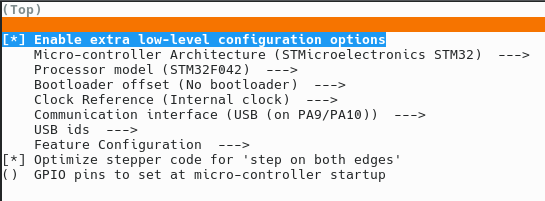
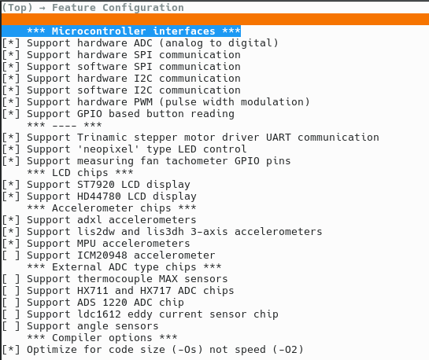
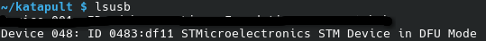

# Maker Coin PCB
The Maker Coin PCB is a MakerCoin sized breakout board featuring an STM32 Microcontroller compatible with both Klipper & Kalico

It should be noted that V1.0, which was handed out at SMRRF2026, has two Silkscreen errors listed below.
# Boot0 & RESET are Mislabeled and are flipped
# AND
# "PA8" LED & Breakout Pin is actually pin PA0

Enter you Klipper configurator with the below
`cd ~/klipper`
`make menuconfig`
Follow the below images for configuring klipper, and disabling some features ready for flashing

	
	

Once this is done, exit with 'Q' and then 'Y' to save

Enter DFU mode by holding down 'RESET' and single pressing 'BOOT0'
You should see something similar to below by running ``lsusb``

	

After confirming it is in DFU mode you can run
``make flash FLASH_DEVICE=0483:df11``
this will flash klipper to the STM32

Once this is done, you can run ``ls /dev/serial/by-id/*`` to get the MCU's serial ID ready for your shenanigans
